# 🚀 Kubernetes GitOps Lab

A comprehensive hands-on laboratory for learning **GitOps**, **Kubernetes**, and **DevOps** best practices using a real-world TODO application. This project demonstrates modern cloud-native development workflows with automated CI/CD, infrastructure as code, and declarative deployment strategies.

[](https://opensource.org/licenses/MIT)
[](https://kubernetes.io/)
[](https://argoproj.github.io/cd/)
[](https://www.docker.com/)
[](https://nodejs.org/)

## 📖 Table of Contents

- [Overview](#-overview)
- [Architecture](#-architecture)
- [Features](#-features)
- [Prerequisites](#-prerequisites)
- [Quick Start](#-quick-start)
- [Project Structure](#-project-structure)
- [GitOps Workflow](#-gitops-workflow)
- [Demo Scenarios](#-demo-scenarios)
- [Technology Stack](#-technology-stack)
- [Learning Path](#-learning-path)
- [Troubleshooting](#-troubleshooting)
- [Contributing](#-contributing)
- [Resources](#-resources)

## 🌟 Overview

This project implements a **production-ready GitOps workflow** using a simple TODO application to demonstrate:

- **Cloud-native development** with containerized microservices
- **GitOps principles** with ArgoCD for automated deployments
- **Multi-environment** management (development, staging)
- **Security-first** approach with sealed secrets and vulnerability scanning
- **Observability** with metrics, health checks, and monitoring
- **Scalability** with Horizontal Pod Autoscaler (HPA)
- **Infrastructure as Code** with Helm charts and Kubernetes manifests

### What You'll Learn

✅ **GitOps Fundamentals** - Declarative, Git-driven operations  
✅ **Kubernetes Orchestration** - Container deployment and management  
✅ **CI/CD Automation** - Automated testing, building, and deployment  
✅ **Security Best Practices** - Secret management and vulnerability scanning  
✅ **Monitoring & Observability** - Metrics collection and health monitoring  
✅ **Infrastructure as Code** - Reproducible infrastructure deployment  

## 🏗️ Architecture

```mermaid
graph TB
    subgraph "Developer Workflow"
        DEV[👨‍💻 Developer] --> GIT[📦 GitHub Repository]
        GIT --> CI[🔄 GitHub Actions]
        CI --> REG[📋 Container Registry]
    end
    
    subgraph "GitOps Workflow"
        GITOPS[📚 GitOps Repository] --> ARGO[🎯 ArgoCD]
        ARGO --> K8S[☸️ Kubernetes Cluster]
    end
    
    subgraph "Kubernetes Cluster (k3d)"
        subgraph "Infrastructure"
            TRAEFIK[🌐 Traefik Ingress]
            METRICS[📊 Metrics Server]
            SEALED[🔐 Sealed Secrets]
        end
        
        subgraph "Applications"
            DEV_ENV[🔧 Development Environment]
            STG_ENV[🚀 Staging Environment]
        end
    end
    
    CI --> ARGO
    REG --> K8S
    TRAEFIK --> DEV_ENV
    TRAEFIK --> STG_ENV
```



### Key Components

- **Application Repository** ([`todo-app/`](./todo-app/)): Node.js/Express REST API with Redis
- **GitOps Repository** ([`todo-gitops/`](./todo-gitops/)): ArgoCD applications and Kubernetes manifests
- **Infrastructure**: k3d cluster with Traefik, ArgoCD, and monitoring

## ✨ Features

### 🎯 Core Application Features
- [x] **RESTful TODO API** with full CRUD operations
- [x] **Redis persistence** for data storage
- [x] **Health checks** and **Prometheus metrics**
- [x] **Input validation** and error handling
- [x] **Security hardening** (non-root containers, read-only filesystem)

### 🔄 GitOps & CI/CD
- [x] **ArgoCD app-of-apps** pattern for multi-application management
- [x] **Automated deployments** to development environment
- [x] **Manual approval** workflow for staging deployments
- [x] **GitHub Actions** CI/CD with testing and security scanning
- [x] **Dependency management** with Renovate Bot

### ☸️ Kubernetes Features
- [x] **Helm charts** with environment-specific configurations
- [x] **Horizontal Pod Autoscaler** (HPA) for automatic scaling
- [x] **Ingress routing** with Traefik
- [x] **ConfigMaps and Secrets** management
- [x] **Resource limits** and **security contexts**
- [x] **Rolling deployments** with zero downtime

### 🔐 Security & Compliance
- [x] **Sealed Secrets** for encrypted secret management
- [x] **Vulnerability scanning** with Trivy
- [x] **SBOM generation** for supply chain security
- [x] **Container security** best practices
- [x] **Network policies** ready

### 📊 Observability
- [x] **Prometheus metrics** collection
- [x] **Health monitoring** endpoints
- [x] **Resource usage** tracking
- [x] **Application performance** metrics
- [x] **Scaling events** monitoring

## 🔧 Prerequisites

### System Requirements

| Component | Version | Purpose |
|-----------|---------|---------|
| **Docker** | 20.10+ | Container runtime |
| **k3d** | 5.4+ | Local Kubernetes cluster |
| **kubectl** | 1.25+ | Kubernetes CLI |
| **Helm** | 3.8+ | Package manager |
| **Git** | 2.30+ | Version control |

### Platform Support

- ✅ **Linux** (Ubuntu 20.04+, Debian 11+)
- ✅ **macOS** (Intel & Apple Silicon)
- ✅ **Windows** (WSL2 + Docker Desktop)

### Installation Scripts

Choose your platform and run the appropriate setup:

**Linux/macOS:**
```bash
curl -fsSL https://raw.githubusercontent.com/k3d-io/k3d/main/install.sh | bash
curl https://raw.githubusercontent.com/helm/helm/main/scripts/get-helm-3 | bash
```

**Windows (PowerShell):**
```powershell
# Install using Chocolatey
choco install kubernetes-cli helm k3d

# Or use Scoop
scoop install kubectl helm k3d
```

## 🚀 Quick Start

### 1. Clone and Setup

```bash
# Clone the repository
git clone <your-repo-url>
cd k8s-gitops-lab

# Navigate to GitOps directory
cd todo-gitops

# Run the bootstrap script
chmod +x bootstrap/setup.sh
./bootstrap/setup.sh
```

The setup script will:
- ✅ Create a local k3d Kubernetes cluster
- ✅ Install ArgoCD, Traefik, and essential components
- ✅ Configure GitOps applications
- ✅ Set up local development environment

### 2. Verify Installation

```bash
# Check cluster status
kubectl get nodes

# Check ArgoCD applications
kubectl get applications -n argocd

# Check all pods
kubectl get pods -A
```

### 3. Access Services

| Service | URL | Credentials |
|---------|-----|-------------|
| **ArgoCD UI** | https://localhost:30443 | admin / (from setup output) |
| **TODO App (Dev)** | http://todo-dev.local:8080 | None |
| **Kubernetes API** | https://localhost:6550 | kubectl context |

### 4. Build and Deploy Application

```bash
# Navigate to application directory
cd ../todo-app

# Build and push to local registry
docker build -t k3d-registry.localhost:5001/todo-app:latest .
docker push k3d-registry.localhost:5001/todo-app:latest

# ArgoCD will automatically detect and deploy!
```

## 📁 Project Structure

```
k8s-gitops-lab/
├── 📱 todo-app/                    # Application Repository
│   ├── 🐳 Dockerfile              # Multi-stage container build
│   ├── 📦 package.json            # Node.js dependencies
│   ├── 🎯 src/server.js           # Express.js application
│   ├── ⚙️ .github/workflows/      # CI/CD pipelines
│   └── ⛵ charts/todo/            # Helm chart
│       ├── 📋 values.yaml         # Default configuration
│       ├── 🔧 values-dev.yaml     # Development settings
│       ├── 🚀 values-stg.yaml     # Staging settings
│       └── 📄 templates/          # Kubernetes manifests
├── 🔄 todo-gitops/                # GitOps Repository
│   ├── 🎯 app-of-apps.yaml        # ArgoCD app-of-apps
│   ├── 📚 applications/           # ArgoCD app definitions
│   ├── 🌍 environments/           # Environment configurations
│   ├── 🔨 bootstrap/              # Setup scripts
│   └── 📖 docs/                   # Architecture documentation
├── 📋 PROJECT_SUMMARY.md          # Detailed project overview
└── 📖 README.md                   # This file
```

### Repository Purposes

| Repository | Purpose | Key Components |
|------------|---------|----------------|
| **`todo-app/`** | Application source code | Source code, Dockerfile, Helm charts, CI/CD |
| **`todo-gitops/`** | GitOps configuration | ArgoCD apps, environment configs, secrets |

## 🔄 GitOps Workflow

### Development Flow

```mermaid
sequenceDiagram
    participant Dev as 👨‍💻 Developer
    participant App as 📱 todo-app
    participant CI as 🔄 GitHub Actions
    participant Reg as 📋 Registry
    participant GitOps as 📚 todo-gitops
    participant ArgoCD as 🎯 ArgoCD
    participant K8s as ☸️ Kubernetes

    Dev->>App: 1. Push code changes
    App->>CI: 2. Trigger CI/CD pipeline
    CI->>CI: 3. Run tests & security scans
    CI->>Reg: 4. Build & push container image
    CI->>GitOps: 5. Update image tag (optional)
    GitOps->>ArgoCD: 6. Detect configuration changes
    ArgoCD->>K8s: 7. Deploy to cluster
    K8s-->>Dev: 8. Application updated
```



### Environment Strategy

| Environment | Sync Policy | Purpose | Namespace |
|-------------|-------------|---------|-----------|
| **Development** | Auto-sync | Continuous integration testing | `todo-dev` |
| **Staging** | Manual approval | Pre-production validation | `todo-staging` |
| **Production** | Manual approval | Live application | `todo-prod` |

## 🎬 Demo Scenarios

### Scenario 1: Application Development Cycle

```bash
# 1. Make code changes
cd todo-app/src
# Edit server.js

# 2. Build and push
docker build -t k3d-registry.localhost:5001/todo-app:v1.1.0 .
docker push k3d-registry.localhost:5001/todo-app:v1.1.0

# 3. Watch ArgoCD auto-deploy
kubectl get pods -n todo-dev -w
```

### Scenario 2: Autoscaling Demo

```bash
# Run the interactive autoscaling demonstration
cd todo-gitops/bootstrap
chmod +x demo.sh
./demo.sh

# Watch HPA in action
kubectl get hpa -n todo-dev -w
```

### Scenario 3: Secret Management

```bash
# Create a sealed secret
echo -n 'super-secret-password' | kubeseal --raw \
  --from-file=/dev/stdin \
  --name my-secret \
  --namespace todo-dev

# Deploy via GitOps
git add . && git commit -m "Add new secret" && git push
```

### Scenario 4: Environment Promotion

```bash
# Tag stable version
git tag v1.2.0
git push origin v1.2.0

# Update staging environment via ArgoCD UI
# Manual sync staging application
```

## 🛠️ Technology Stack

### Application Stack
| Technology | Purpose | Version |
|------------|---------|---------|
| **Node.js** | Runtime environment | 18+ |
| **Express.js** | Web framework | ^4.18 |
| **Redis** | Data persistence | Alpine |
| **Joi** | Input validation | ^17.11 |

### Infrastructure Stack
| Technology | Purpose | Version |
|------------|---------|---------|
| **Kubernetes** | Container orchestration | 1.25+ |
| **k3d** | Local K8s clusters | 5.4+ |
| **ArgoCD** | GitOps operator | 2.8+ |
| **Traefik** | Ingress controller | Latest |
| **Helm** | Package manager | 3.8+ |

### DevOps Tools
| Tool | Purpose | Integration |
|------|---------|-------------|
| **GitHub Actions** | CI/CD automation | Automated testing, building |
| **Trivy** | Vulnerability scanning | Security pipeline |
| **Renovate** | Dependency management | Automated updates |
| **Sealed Secrets** | Secret encryption | Secure GitOps |

## 📚 Learning Path

### Beginner Track (Week 1-2)
1. **Setup Environment** - Run quick start guide
2. **Explore Application** - Understand TODO API
3. **GitOps Basics** - Learn ArgoCD interface
4. **Deploy Changes** - Make simple code modifications

### Intermediate Track (Week 3-4)
1. **Helm Customization** - Modify chart values
2. **Multi-Environment** - Deploy to staging
3. **Secret Management** - Create sealed secrets
4. **Monitoring Setup** - Configure metrics

### Advanced Track (Week 5-6)
1. **Security Hardening** - Implement policies
2. **Custom Operators** - Extend functionality
3. **Production Setup** - Real cluster deployment
4. **Disaster Recovery** - Backup strategies

## 🐛 Troubleshooting

### Common Issues

#### 🔴 Cluster Creation Fails
```bash
# Check Docker status
docker info

# Clean up existing clusters
k3d cluster delete todo-local

# Retry with verbose logging
k3d cluster create todo-local --verbose
```

#### 🔴 ArgoCD Not Accessible
```bash
# Check ArgoCD pods
kubectl get pods -n argocd

# Port forward as backup
kubectl port-forward svc/argocd-server -n argocd 8080:80
```

#### 🔴 Application Sync Issues
```bash
# Force refresh application
argocd app get todo-dev --refresh

# Check application logs
kubectl logs -f deployment/todo -n todo-dev
```

#### 🔴 Registry Push Fails
```bash
# Verify registry is running
docker ps | grep registry

# Test registry connectivity
curl -k http://k3d-registry.localhost:5001/v2/_catalog
```

### Getting Help

1. **Check Logs**: `kubectl logs -f deployment/todo -n todo-dev`
2. **Describe Resources**: `kubectl describe pod <pod-name> -n todo-dev`
3. **ArgoCD Status**: `argocd app get todo-dev`
4. **Health Checks**: `curl http://todo-dev.local:8080/healthz`

For detailed troubleshooting, see: [`todo-gitops/docs/TROUBLESHOOTING.md`](./todo-gitops/docs/TROUBLESHOOTING.md)

## 🤝 Contributing

We welcome contributions! Here's how to get started:

### Development Process
1. **Fork** the repository
2. **Create** a feature branch: `git checkout -b feature/amazing-feature`
3. **Make** your changes and add tests
4. **Test** locally using the setup scripts
5. **Commit** your changes: `git commit -m 'Add amazing feature'`
6. **Push** to the branch: `git push origin feature/amazing-feature`
7. **Open** a Pull Request

### Contribution Areas
- 📚 **Documentation improvements**
- 🐛 **Bug fixes and issue resolution**
- ✨ **New feature development**
- 🔧 **Infrastructure enhancements**
- 🧪 **Additional demo scenarios**
- 🔐 **Security improvements**

### Code Standards
- ✅ Follow existing code style
- ✅ Add appropriate tests
- ✅ Update documentation
- ✅ Ensure security best practices

## 📖 Resources

### Official Documentation
- 📘 [Kubernetes Documentation](https://kubernetes.io/docs/)
- 📗 [ArgoCD Documentation](https://argo-cd.readthedocs.io/)
- 📙 [Helm Documentation](https://helm.sh/docs/)
- 📕 [k3d Documentation](https://k3d.io/)

### Learning Resources
- 🎓 [GitOps Principles](https://www.gitops.tech/)
- 📺 [CNCF YouTube Channel](https://www.youtube.com/c/cloudnativefdn)
- 📚 [Kubernetes Learning Path](https://azure.microsoft.com/en-us/resources/kubernetes-learning-path/)
- 🏆 [Certified Kubernetes Administrator (CKA)](https://www.cncf.io/certification/cka/)

### Community
- 💬 [Kubernetes Slack](https://kubernetes.slack.com/)
- 🐦 [CNCF Twitter](https://twitter.com/cloudnativefdn)
- 📝 [GitOps Working Group](https://github.com/gitops-working-group/gitops-working-group)

## 📄 License

This project is licensed under the **MIT License** - see the [LICENSE](LICENSE) file for details.

## 🙏 Acknowledgments

- **Cloud Native Computing Foundation (CNCF)** for the amazing ecosystem
- **ArgoCD Team** for the excellent GitOps platform
- **Kubernetes Community** for the robust orchestration platform
- **All Contributors** who helped improve this project

---

<div align="center">

**⭐ Star this repository if you found it helpful!**

*Happy GitOps-ing! 🚀*


</div>