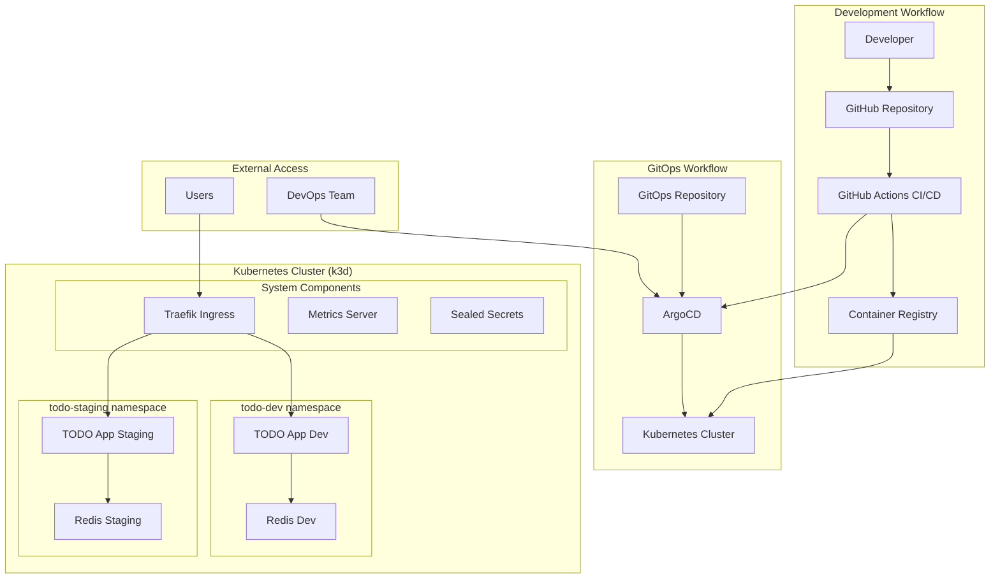
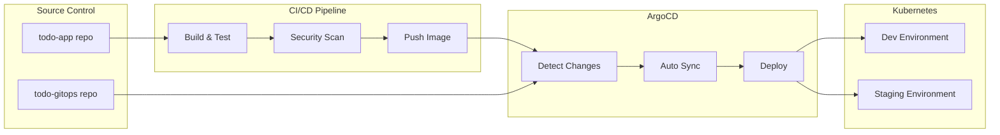
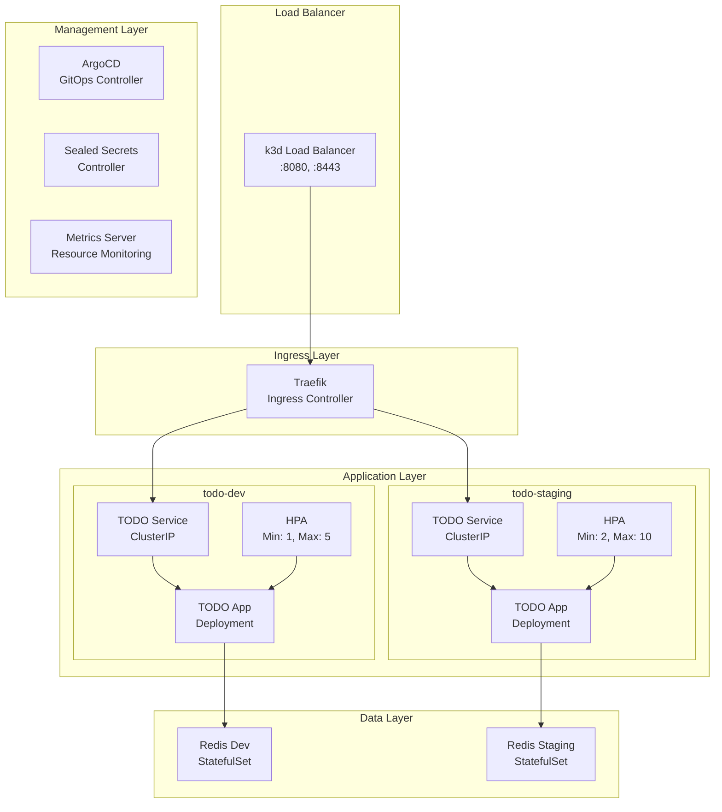
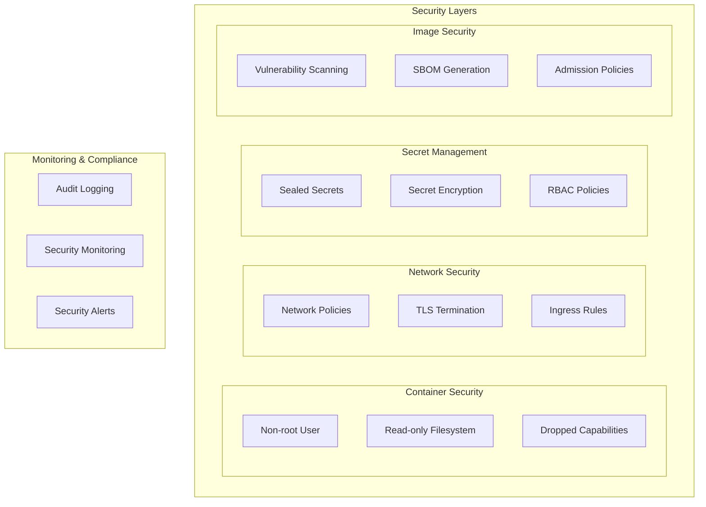
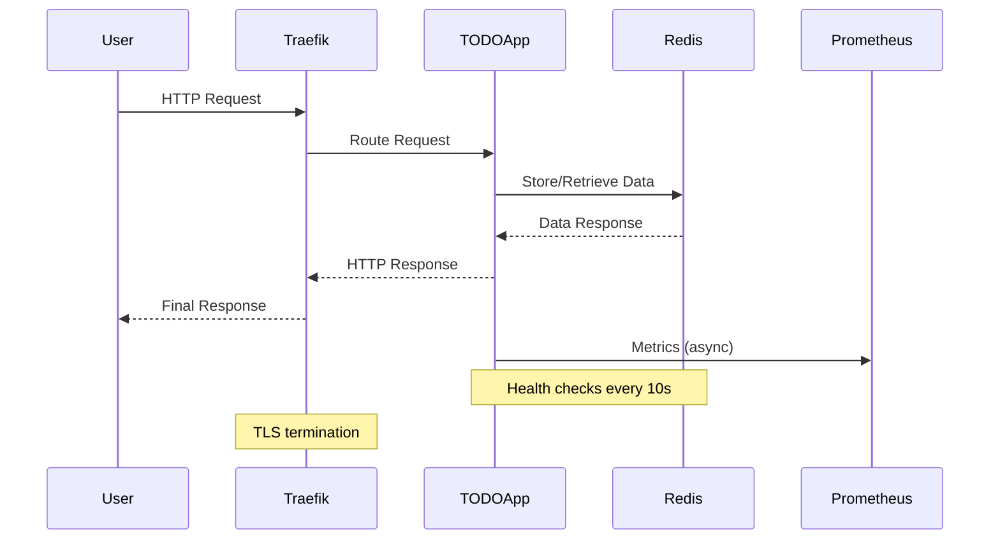
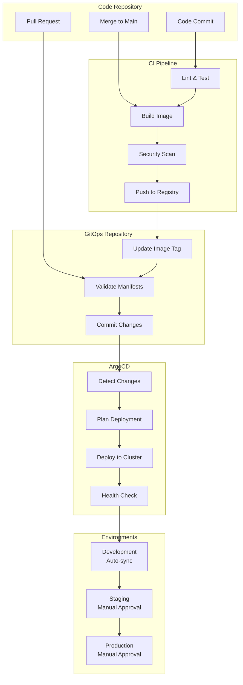

# System Architecture

## Overview Architecture

```mermaid
graph TB
    subgraph "Development Workflow"
        DEV[Developer] --> GIT[GitHub Repository]
        GIT --> CI[GitHub Actions CI/CD]
        CI --> REG[Container Registry]
    end
    
    subgraph "GitOps Workflow"
        GITOPS[GitOps Repository] --> ARGO[ArgoCD]
        ARGO --> K8S[Kubernetes Cluster]
    end
    
    subgraph "Kubernetes Cluster (k3d)"
        subgraph "System Components"
            TRAEFIK[Traefik Ingress]
            METRICS[Metrics Server]
            SEALED[Sealed Secrets]
        end
        
        subgraph "todo-dev namespace"
            TODODEV[TODO App Dev]
            REDISDEV[Redis Dev]
            TODODEV --> REDISDEV
        end
        
        subgraph "todo-staging namespace"
            TODOSTG[TODO App Staging]
            REDISSTG[Redis Staging]
            TODOSTG --> REDISSTG
        end
    end
    
    subgraph "External Access"
        USER[Users] --> TRAEFIK
        DEVOPS[DevOps Team] --> ARGO
    end
    
    CI --> ARGO
    REG --> K8S
    TRAEFIK --> TODODEV
    TRAEFIK --> TODOSTG
```

## GitOps Flow

```mermaid
graph LR
    subgraph "Source Control"
        APP[todo-app repo]
        GITOPS[todo-gitops repo]
    end
    
    subgraph "CI/CD Pipeline"
        BUILD[Build & Test]
        SCAN[Security Scan]
        PUSH[Push Image]
    end
    
    subgraph "ArgoCD"
        DETECT[Detect Changes]
        SYNC[Auto Sync]
        DEPLOY[Deploy]
    end
    
    subgraph "Kubernetes"
        DEV[Dev Environment]
        STG[Staging Environment]
    end
    
    APP --> BUILD
    BUILD --> SCAN
    SCAN --> PUSH
    PUSH --> DETECT
    GITOPS --> DETECT
    DETECT --> SYNC
    SYNC --> DEPLOY
    DEPLOY --> DEV
    DEPLOY --> STG
```

## Component Architecture

```mermaid
graph TB
    subgraph "Load Balancer"
        LB[k3d Load Balancer<br/>:8080, :8443]
    end
    
    subgraph "Ingress Layer"
        TRAEFIK[Traefik<br/>Ingress Controller]
    end
    
    subgraph "Application Layer"
        subgraph "todo-dev"
            APPDEV[TODO App<br/>Deployment]
            SVCDEV[TODO Service<br/>ClusterIP]
            HPADEV[HPA<br/>Min: 1, Max: 5]
        end
        
        subgraph "todo-staging"
            APPSTG[TODO App<br/>Deployment]
            SVCSTG[TODO Service<br/>ClusterIP]
            HPASTG[HPA<br/>Min: 2, Max: 10]
        end
    end
    
    subgraph "Data Layer"
        RDEV[Redis Dev<br/>StatefulSet]
        RSTG[Redis Staging<br/>StatefulSet]
    end
    
    subgraph "Management Layer"
        ARGO[ArgoCD<br/>GitOps Controller]
        SEALED[Sealed Secrets<br/>Controller]
        METRICS[Metrics Server<br/>Resource Monitoring]
    end
    
    LB --> TRAEFIK
    TRAEFIK --> SVCDEV
    TRAEFIK --> SVCSTG
    SVCDEV --> APPDEV
    SVCSTG --> APPSTG
    APPDEV --> RDEV
    APPSTG --> RSTG
    HPADEV --> APPDEV
    HPASTG --> APPSTG
```

## Security Architecture

```mermaid
graph TB
    subgraph "Security Layers"
        subgraph "Container Security"
            NONROOT[Non-root User]
            READONLY[Read-only Filesystem]
            CAPS[Dropped Capabilities]
        end
        
        subgraph "Network Security"
            NETPOL[Network Policies]
            TLS[TLS Termination]
            INGRESS[Ingress Rules]
        end
        
        subgraph "Secret Management"
            SEALED[Sealed Secrets]
            VAULT[Secret Encryption]
            RBAC[RBAC Policies]
        end
        
        subgraph "Image Security"
            SCAN[Vulnerability Scanning]
            SBOM[SBOM Generation]
            POLICY[Admission Policies]
        end
    end
    
    subgraph "Monitoring & Compliance"
        AUDIT[Audit Logging]
        MONITOR[Security Monitoring]
        ALERT[Security Alerts]
    end
```

## Data Flow

```mermaid
sequenceDiagram
    participant User
    participant Traefik
    participant TODOApp
    participant Redis
    participant Prometheus
    
    User->>Traefik: HTTP Request
    Traefik->>TODOApp: Route Request
    TODOApp->>Redis: Store/Retrieve Data
    Redis-->>TODOApp: Data Response
    TODOApp-->>Traefik: HTTP Response
    Traefik-->>User: Final Response
    
    TODOApp->>Prometheus: Metrics (async)
    Note over TODOApp,Redis: Health checks every 10s
    Note over Traefik: TLS termination
```

## Deployment Pipeline

```mermaid
graph TB
    subgraph "Code Repository"
        COMMIT[Code Commit]
        PR[Pull Request]
        MERGE[Merge to Main]
    end
    
    subgraph "CI Pipeline"
        LINT[Lint & Test]
        BUILD[Build Image]
        SECURITY[Security Scan]
        PUSH[Push to Registry]
    end
    
    subgraph "GitOps Repository"
        UPDATE[Update Image Tag]
        VALIDATE[Validate Manifests]
        COMMIT_GITOPS[Commit Changes]
    end
    
    subgraph "ArgoCD"
        DETECT[Detect Changes]
        PLAN[Plan Deployment]
        DEPLOY[Deploy to Cluster]
        HEALTH[Health Check]
    end
    
    subgraph "Environments"
        DEV[Development<br/>Auto-sync]
        STG[Staging<br/>Manual Approval]
        PROD[Production<br/>Manual Approval]
    end
    
    COMMIT --> LINT
    PR --> VALIDATE
    MERGE --> BUILD
    LINT --> BUILD
    BUILD --> SECURITY
    SECURITY --> PUSH
    PUSH --> UPDATE
    UPDATE --> VALIDATE
    VALIDATE --> COMMIT_GITOPS
    COMMIT_GITOPS --> DETECT
    DETECT --> PLAN
    PLAN --> DEPLOY
    DEPLOY --> HEALTH
    HEALTH --> DEV
    DEV --> STG
    STG --> PROD
```